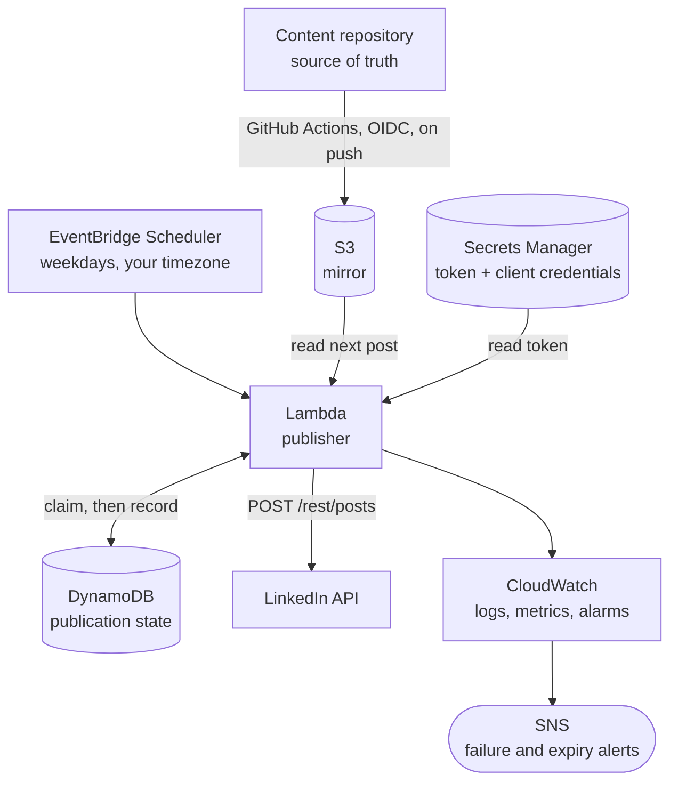

# Serverless Social Publisher

Publish Markdown posts to social platforms on a schedule, using AWS Lambda,
EventBridge Scheduler, DynamoDB, and Secrets Manager. Terraform included.

> **Status: running in production**, publishing to LinkedIn on a weekday
> schedule. X and Threads support is not written yet.

## Why this exists

Writing posts and publishing posts are different problems. Content belongs in
a repository where it can be drafted, reviewed, and versioned. Publishing is
plumbing: a schedule, an API call, and a record of what already went out.

This project is the plumbing. It reads Markdown from S3, renders it for the
target platform, publishes it, and records the result — so the same content
can be authored once and delivered anywhere.

## Architecture



The content repository stays authoritative; S3 is a cache that can be rebuilt
at any time. See [ADR-0001](docs/adr/0001-content-source-is-mirrored-to-s3.md).

## How it works

1. EventBridge Scheduler invokes the function on a cron schedule, in your own
   timezone rather than UTC.
2. The function finds the earliest post not yet published, according to
   DynamoDB — not according to filenames or folders.
   ([ADR-0002](docs/adr/0002-publication-state-lives-in-dynamodb.md))
3. It renders the Markdown into platform-ready text: emphasis markers removed,
   because LinkedIn publishes asterisks literally rather than rendering them.
4. It claims the post with a conditional write, so a retried invocation cannot
   publish the same day twice, and then posts.
5. Success stores the post URN. Failure alerts through SNS.

## Supported platforms

| Platform | Status | Notes |
| --- | --- | --- |
| LinkedIn | implemented | personal profile, self-serve API tier |
| X | planned | |
| Threads | planned | |

Platforms without a public publishing API — Xiaohongshu, YouTube Community —
are deliberately out of scope. They require browser automation, which does not
belong in Lambda, and the terms of service around automating them are their
own conversation.

## Setup

You need an AWS account, Terraform, Python 3.12, and a LinkedIn app.

The LinkedIn side takes about 40 minutes and needs no approval process:
**[docs/setup-linkedin-app.md](docs/setup-linkedin-app.md)**.

Verify your token before deploying anything:

```bash
python scripts/check_access.py
```

Then:

```bash
cd infrastructure/terraform
cp terraform.tfvars.example terraform.tfvars   # edit it
terraform init && terraform apply
```

Populate the secret with the token, and copy
[examples/mirror-content.yml](examples/mirror-content.yml) into the repository
holding your posts so it syncs them to S3 on every push. Leave `dry_run = true`
for the first run: it exercises the whole pipeline and publishes nothing.

## Limitations worth knowing before you start

These are properties of the LinkedIn API, not of this project. Both are
measured, not assumed — reproduce them with the script above.

**The access token expires every 60 days, and cannot be refreshed
automatically.** Refresh tokens are issued only to approved Marketing
Developer Platform partners. A self-serve app re-authorizes by hand. This
project treats that as a scheduled event: it alarms 7 days before expiry
rather than discovering the problem through a week of silent 401s.
([ADR-0004](docs/adr/0004-access-token-lifecycle.md))

**Commenting through the API is not available on the self-serve tier.**
`w_member_social` does not grant it, despite what several third-party guides
say; the Comments API requires `w_member_social_feed`, which belongs to the
review-gated Community Management API.
([ADR-0003](docs/adr/0003-glossary-inline.md))

## Cost

Real numbers for one post per weekday, not a "serverless is free" hand-wave:

| Service | Monthly |
| --- | --- |
| Secrets Manager | USD 0.40 per secret |
| Lambda, EventBridge, DynamoDB, S3, CloudWatch, SNS | effectively 0 at this volume |

**Around USD 0.40–0.80 per month**, dominated entirely by Secrets Manager,
which has no permanent free tier. SSM Parameter Store would remove that cost;
this project uses Secrets Manager for its rotation support and audit trail.

## Development

```bash
pip install -r requirements-dev.txt
pytest
```

There are no runtime dependencies. The Lambda runtime already provides boto3,
and the API client uses `urllib` from the standard library, so the deployment
package carries no third-party code.

## Design decisions

Recorded as ADRs, including the alternatives that were rejected and why.

| | Decision |
| --- | --- |
| [0001](docs/adr/0001-content-source-is-mirrored-to-s3.md) | The content repository stays the source of truth, mirrored to S3 |
| [0002](docs/adr/0002-publication-state-lives-in-dynamodb.md) | Publication state lives in DynamoDB, not in filenames |
| [0003](docs/adr/0003-glossary-inline.md) | The glossary is published inline, because commenting is partner-gated |
| [0004](docs/adr/0004-access-token-lifecycle.md) | Token expiry is a scheduled event, and is read from LinkedIn rather than recorded |
| [0005](docs/adr/0005-trust-github-by-immutable-ids.md) | CI is trusted by immutable repository ID, not by name |

## License

MIT
