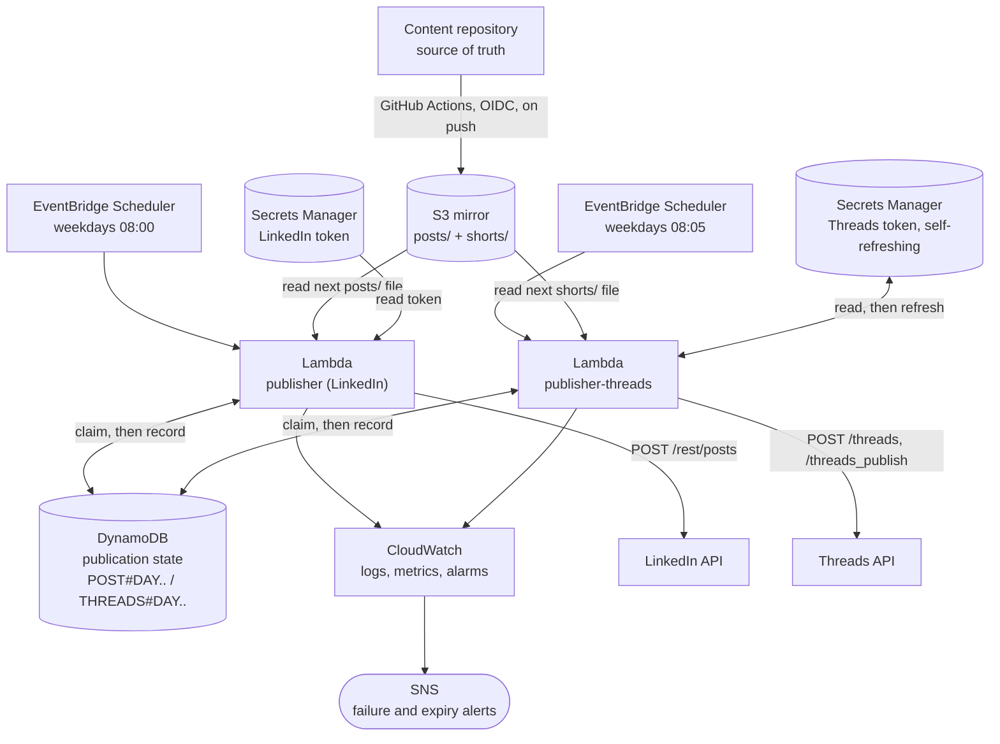

# Serverless Social Publisher

Publish Markdown posts to social platforms on a schedule, using AWS Lambda,
EventBridge Scheduler, DynamoDB, and Secrets Manager. Terraform included.

> **Status: running in production**, publishing to LinkedIn and Threads on a
> weekday schedule. X support is not written yet.

## Why this exists

Writing posts and publishing posts are different problems. Content belongs in
a repository where it can be drafted, reviewed, and versioned. Publishing is
plumbing: a schedule, an API call, and a record of what already went out.

This project is the plumbing. It reads Markdown from S3, renders it for the
target platform, publishes it, and records the result — so the same content
can be authored once and delivered anywhere.

## Architecture



The content repository stays authoritative; S3 is a cache that can be rebuilt
at any time. See [ADR-0001](docs/adr/0001-content-source-is-mirrored-to-s3.md).
LinkedIn and Threads are two independent Lambdas sharing only the bucket and
the state table, under separate prefixes and a separate key namespace — see
[ADR-0007](docs/adr/0007-threads-is-a-second-independent-publisher.md).

## How it works

Both platforms follow the same five steps, in their own Lambda:

1. EventBridge Scheduler invokes the function on a cron schedule, in your own
   timezone rather than UTC.
2. The function finds the earliest post not yet published, according to
   DynamoDB — not according to filenames or folders.
   ([ADR-0002](docs/adr/0002-publication-state-lives-in-dynamodb.md))
3. It renders the Markdown into platform-ready text: emphasis markers
   removed, because neither platform renders asterisks — both publish them
   literally.
4. It claims the post with a conditional write, so a retried invocation cannot
   publish the same day twice, and then posts.
5. Success stores the post id. Failure alerts through SNS.

The Threads function does one thing first that the LinkedIn one does not:
check whether its access token needs refreshing, and refresh it if so — see
[ADR-0007](docs/adr/0007-threads-is-a-second-independent-publisher.md).

## Supported platforms

| Platform | Status | Notes |
| --- | --- | --- |
| LinkedIn | implemented | personal profile, self-serve API tier |
| Threads | implemented | personal account, publishes the Threads section of `/aws-shorts` output |
| X | planned | |

Platforms without a public publishing API — Xiaohongshu, YouTube Community —
are deliberately out of scope. They require browser automation, which does not
belong in Lambda, and the terms of service around automating them are their
own conversation.

## Setup

You need an AWS account, Terraform, Python 3.12, and app credentials for
whichever platform(s) you are deploying.

- LinkedIn, about 40 minutes, no approval process:
  **[docs/setup-linkedin-app.md](docs/setup-linkedin-app.md)**
- Threads, about 30 minutes, no approval process:
  **[docs/setup-threads-app.md](docs/setup-threads-app.md)**

Verify each token before deploying anything:

```bash
python scripts/check_access.py            # LinkedIn
python scripts/check_threads_access.py    # Threads
```

Then:

```bash
cd infrastructure/terraform
cp terraform.tfvars.example terraform.tfvars   # edit it
terraform init && terraform apply
```

Populate both secrets with their tokens (`terraform output` prints the secret
names), and copy [examples/mirror-content.yml](examples/mirror-content.yml)
into the repository holding your posts so it syncs `posts/` and `shorts/` to
S3 on every push. Leave `dry_run` / `threads_dry_run` at their defaults
(`true`) for the first run of each: it exercises the whole pipeline and
publishes nothing.

## Limitations worth knowing before you start

These are properties of the platform APIs, not of this project. All of them
are measured, not assumed — reproduce them with the scripts above.

**LinkedIn's access token expires every 60 days, and cannot be refreshed
automatically.** Refresh tokens are issued only to approved Marketing
Developer Platform partners. A self-serve app re-authorizes by hand. This
project treats that as a scheduled event: it alarms 7 days before expiry
rather than discovering the problem through a week of silent 401s.
([ADR-0004](docs/adr/0004-access-token-lifecycle.md))

**Threads' token can be refreshed, and this project does it automatically.**
No human re-authorization step exists in normal operation — see
[ADR-0007](docs/adr/0007-threads-is-a-second-independent-publisher.md). The
expiry alarm still exists, but firing it means the automatic refresh itself
has been failing, which is worth knowing regardless.

**Commenting through LinkedIn's API is not available on the self-serve
tier.** `w_member_social` does not grant it, despite what several
third-party guides say; the Comments API requires `w_member_social_feed`,
which belongs to the review-gated Community Management API.
([ADR-0003](docs/adr/0003-glossary-inline.md))

## Cost

Real numbers for one post per weekday per platform, not a "serverless is
free" hand-wave:

| Service | Monthly |
| --- | --- |
| Secrets Manager | USD 0.40 per secret — two secrets (LinkedIn, Threads) if both are deployed |
| Lambda, EventBridge, DynamoDB, S3, CloudWatch, SNS | effectively 0 at this volume |

**Around USD 0.40–0.80 per platform per month**, dominated entirely by
Secrets Manager, which has no permanent free tier. SSM Parameter Store would
remove that cost; this project uses Secrets Manager for its rotation support,
audit trail, and — for Threads — because the Lambda writes to it directly on
refresh.

## Development

```bash
pip install -r requirements-dev.txt
pytest
```

There are no runtime dependencies. The Lambda runtime already provides boto3,
and the API client uses `urllib` from the standard library, so the deployment
package carries no third-party code.

## Design decisions

Recorded as ADRs, including the alternatives that were rejected and why.

| | Decision |
| --- | --- |
| [0001](docs/adr/0001-content-source-is-mirrored-to-s3.md) | The content repository stays the source of truth, mirrored to S3 |
| [0002](docs/adr/0002-publication-state-lives-in-dynamodb.md) | Publication state lives in DynamoDB, not in filenames |
| [0003](docs/adr/0003-glossary-inline.md) | The glossary is published inline, because commenting is partner-gated |
| [0004](docs/adr/0004-access-token-lifecycle.md) | Token expiry is a scheduled event, and is read from LinkedIn rather than recorded |
| [0005](docs/adr/0005-trust-github-by-immutable-ids.md) | CI is trusted by immutable repository ID, not by name |
| [0006](docs/adr/0006-verifying-what-was-published.md) | Publishing can fail without saying so, so silence is what gets alarmed |
| [0007](docs/adr/0007-threads-is-a-second-independent-publisher.md) | Threads is a second, independent publisher, with an auto-refreshing token unlike LinkedIn's |

## License

MIT

---

<details>
<summary>日本語</summary>

英語版が正です。この節は概要のみで、更新が遅れることがあります。

**Markdown で書いた記事を、AWS のサーバーレス構成で SNS に定時配信するフレームワーク。**
現在 LinkedIn・Threads へ平日毎朝1本ずつ、**本番稼働中**です。

内容を書く場所と配信する仕組みを分離しています。記事は Git リポジトリで管理し、
AWS 側はそれを読んで配信するだけの層に徹します。同じ原稿を書き直さずに配信先を
増やせる構成です。LinkedIn と Threads は完全に独立した Lambda・スケジュール・
IAM ロールで動いており、S3 バケットと DynamoDB テーブルのみを共有します（ADR-0007）。

**使用サービス**
Lambda / EventBridge Scheduler / DynamoDB / S3 / Secrets Manager / CloudWatch / SNS / IAM。
IaC は Terraform、CI は GitHub Actions（OIDC 認証・アクセスキー不使用）。
実行時の外部依存はゼロ（boto3 はランタイム同梱、HTTP は標準ライブラリ）。

**設計判断は ADR として残しています**（英語・上の表）。採用した案だけでなく、
**棄却した案とその理由**を書いています。

**実測した運用制約**

- LinkedIn のアクセストークンは60日で失効し、self-serve 枠では自動更新できない。
  失効を「事故」ではなく「予定」として扱い、残7日で通知する
- Threads のトークンは逆にリフレッシュ可能なため、Lambda が残14日を切ったら
  自動更新し、Secrets Manager に書き戻す。人手による再認証は通常運用では発生しない
- LinkedIn のコメント投稿 API はパートナー限定（403 を実測で確認）。用語解説は
  本文に統合した
- 月額 **プラットフォームごとに USD 0.40〜0.80**。ほぼ全額が Secrets Manager

</details>
